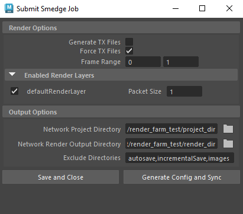

# MtoA Remote Smedge Submit Script

A simple Maya script for syncing remote render directories and generating config files for the Smedge render manager. This uses `robocopy` for file syncing, so it's Windows-only.

## How It Works

Running the script gives you access to a UI you can use to set your render settings. There are two parts to this script: it first uses `robocopy` to sync your Maya project to your network project directory, and then uses the other settings to generate a Smedge config file for each of your render layers. Smedge config files will be placed in the same directory as your network project. The names of your render output files will be the same as the ones set in your main render settings.

The TX file options rely on Arnold command line arguments that aren't configured properly in some versions of the MtoA plugin, so you may also need to install the [MtoA TX Typo Fix](https://github.com/ollyisonit/mtoa-tx-typo-fix)

## Installation
Open `submit-smedge-render.py` in the Maya script editor, and then either run it directly or select `File > Save Script to Shelf...` to create a button for it.